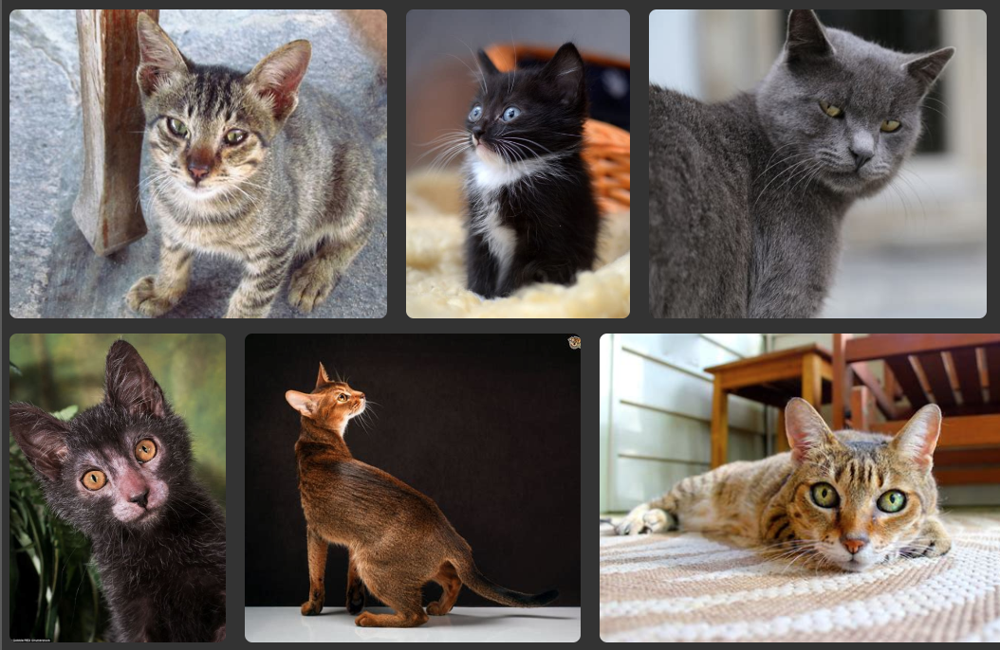

# The dogs
`From Wikipedia, the free encyclopedia`

```
Some text about cats, whatevert
```

Of course dont forget to talks about dgs

## Associated terms
Associated terms
- A group of cats can be referred to as a clowder or a glaring.
- A male cat is called a tom or tomcat (or a gib, if neutered)


[Cats on Wikipedia](https://en.wikipedia.org/wiki/Cat)