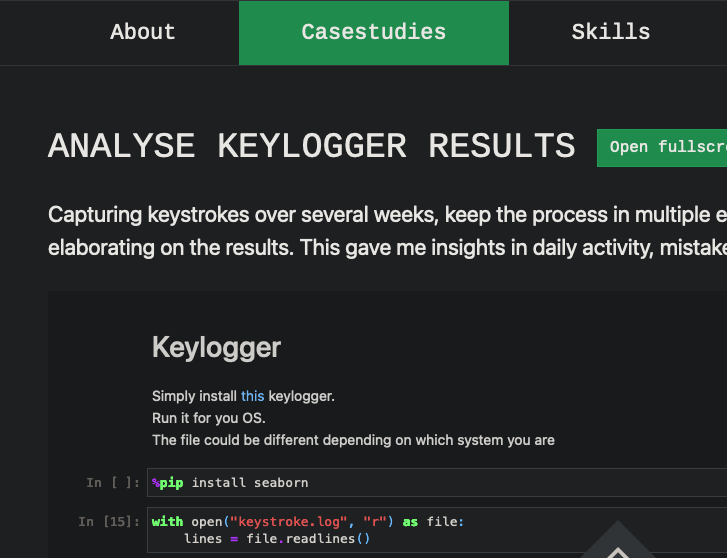

# Static html wrapped in a docker container

The repository to my portfolio [tmy.io](https://tmy.io).
Handlebars builds stone-age templates into static html files.

# Publish flow

## Build
`docker build --progress=plain -t ghcr.io/spielhoelle/portfolio .`

## Run
`docker run --name portfolio --rm -it -p 3000:80 ghcr.io/spielhoelle/portfolio:latest`

## Push
`docker push ghcr.io/spielhoelle/portfolio`

# Dev
Simply: `docker compose up`

or in two terminals:  
- `nodemon -w src/index.hbs src/compile.js`
- `cd app && live-server`

# Test endpoints

- `curl http://localhost:3000/tmy/index.html`
- `curl http://localhost:3000/app2/index.html`